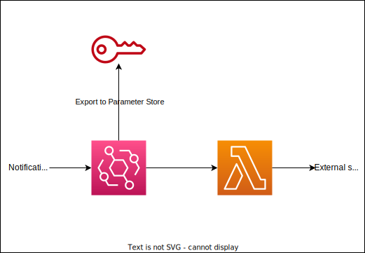

# My Notification Service

This is a service that handles notifications from my applications.

This project exposes the IAM credential, which is used to execute put-events for the EventBridge, to the Parameter Store.

The producer of the messages must take this policy.
The incoming events are forwarded to the lambda and sent to the external third-party applications.